# Rapport Séries Temporelles
Patricio Silva

## Introduction 
La série temporelle à étudier pour ce projet est la variation mensuelle de l'IPC en la France métropolitaine entre janvier 1996 et décembre 2025, ce qui rend une série de 360 observations mensuelles.

Cette variation de l'IPC correspond à l'inflation sous-jacente hors produits volatils ou régulés tel que l'énérgie, le tabaco, etc. Ce groupe de produits correspond au code 4035 de l'INSEE après d'être controlés pour les effets saissonaires.

Les données on été récuperées depuis [ce cite de l'INSEE](https://catalogue-donnees.insee.fr/fr/catalogue/recherche/DS_IPC_PRINC).

Pour la suite, des autres séries seront considérées pour les modèles multivariées. Comme rappel, la variation de l'IPC est calculée avec l'expression ci-dessous:
$$
\dfrac{IPC_{t} - IPC_{t-1}}{IPC_{t-1}} \cdot 100 \quad [\%]
$$
ce qui rend une pourcentage de variation par rapport à la valeur précedente

## Objectif du projet
Le but de ce projet est d'étudier cette série avec des modèles statistiques, ainsi que comparer ses résultats avec des autres observations

## Statistiques descriptives
Tout d'abord, le plot de la série temporelle par rapport au temps est montrée ci-dessous:
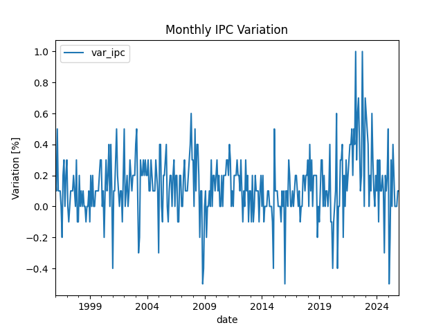 ce qui ressemble le comportement attendu, une série sans tendances ni saissonalité apparente, avec un bruit considerable autour de la moyenne.

La distribution des données est mieux appreciée sur son histogramme 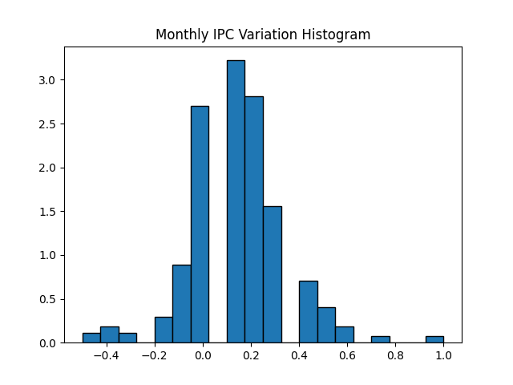 où les données semblent se concentrer autour de zéro, avec une distribution assez simmetrique, avec certaines valuers sous-représentées. Avec Kernel Density de sklearn, la densité sous-jacente peut être approximée, obtenant la courve de la figure suivante
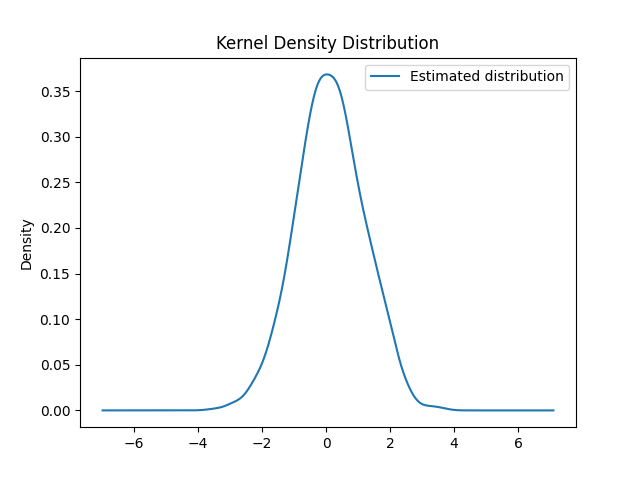 qui ressemble le comportement attendu des données avec une variance assez petite.

Ensuite, les mesures statistiques des données sont presentées dans le tableau suivant:

|Mesure|Valeur|
|------|-----|
|count |360.0|
|mean  |0.1322222222222222|
|std   |0.19990403144739186|
|min   |-0.5 |
|25%   |0.0  |
|50%   |0.1  |
|75%   |0.2  |
|max   |1.0  |
|median|0.1  |
|skewness|0.2790459386191692|
|kurtosis|2.40494439800041|

Ce qui nous informe d'une distribution assez similaire à la gaussienne, avec des queues plsu légères sauf quelques valeurs élévées.

Ensuite, la fonction d'autocorrelation et autocorrélation partielle sont visibles ci-dessous:
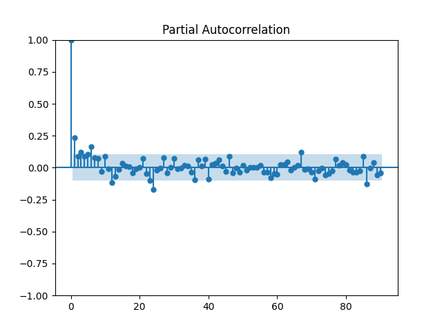 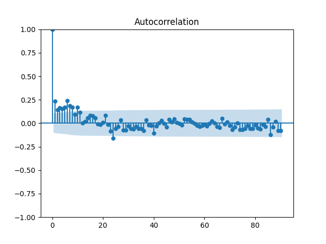 ce qui montre une faible autocorrélation qui decroît rapidement vers zéro et reste dans l'interval de confiance, sans évidence observable d'éffets saissonaires, ce qui montre uniquement une certaine dépendence a court terme. Cela nous amène à la modélisation avec ARMA

## ARMA
Pour la suite, des modèles ARMA ont été stimées avec $p,q\in\{0,1,2,3\}$ et leurs p-values ont été notées dans le tableau suivant:

|coefficient|0,0|0,1|0,2  |0,3  |1,0|1,1|1,2  |1,3  |2,0  |2,1  |2,2  |3,0  |3,1  |
|------|---|---|-----|-----|---|---|-----|-----|-----|-----|-----|-----|-----|
|const |0.0|0.0|0.0  |0.0  |0.0|0.0|0.0  |0.0  |0.0  |0.0  |0.0  |0.0  |0.0  |
|sigma2|0.0|0.0|0.0  |0.0  |0.0|0.0|0.0  |0.0  |0.0  |0.0  |0.0  |0.0  |0.0  |
|ma.L1 |   |0.0|0.0  |0.0  |   |0.0|0.0  |0.0  |     |0.0  |0.65 |     |0.0  |
|ma.L2 |   |   |0.103|0.064|   |   |0.468|0.152|     |     |0.454|     |     |
|ma.L3 |   |   |     |0.045|   |   |     |0.106|     |     |     |     |     |
|ar.L1 |   |   |     |     |0.0|0.0|0.0  |0.0  |0.0  |0.0  |0.491|0.0  |0.0  |
|ar.L2 |   |   |     |     |   |   |     |     |0.067|0.548|0.53 |0.211|0.181|
|ar.L3 |   |   |     |     |   |   |     |     |     |     |     |0.008|0.16 |

Les modèles qui n'ont pas convergé ont été omis. Ci dessous, es coefficients des modèles à droite d'ARMA(1,1), ainsi qu'ARMA(0,2) et ARMA(0,3) ont un ou plusieurs coefficients non significatifs, ce qui nous amène a considérer les modèles ARMA(0,0), ARMA(0,1), ARMA(1,0) et ARMA(1,1). Pour les comparer, les valeurs des critères AIC et BIC ont été obtenus et sont montrées ci-dessous:

|Modèle|AIC|BIC|
|------|---|---|
|0,0   |-134.50651353848326|-126.73430547558294|
|0,1   |-149.81847236017805|-138.16016026582759|
|0,2   |-150.46227825324894|-134.9178621274483|
|0,3   |-152.27654642179414|-132.84602626454335|
|1,0   |-152.99696973029992|-141.33865763594946|
|1,1   |-170.83749535392812|-155.2930792281275|
|1,2   |-169.30523557059814|-149.87471541334736|
|1,3   |-169.7092607331736|-146.39263654447268|
|2,0   |-153.9667387805323|-138.42232265473166|
|2,1   |-169.22153143814103|-149.79101128089025|
|2,2   |-167.9545733427326|-144.63794915403167|
|3,0   |-157.45586297665375|-138.02534281940297|
|3,1   |-169.38914123058737|-146.07251704188644|

Selon le critère AIC, le modèle ARMA(1,1) est le meilleur, ce qui coïncide avec le résultat du BIC, d'où ce modèle sera consideré pour la suite.

L'inverse des racines du modèle sont 0.92473456(AR) et 0.79524914 (MA) ce qui mettre en question la stationnarité de la série, ce qui devra être étudié pour la suite.

### Étude des résidus
Pour vérifier la stationnarité de la série, la PACF et l'ACF ont été obtenues pour les résidus du modèle, obtenant les figures ci-dessous: 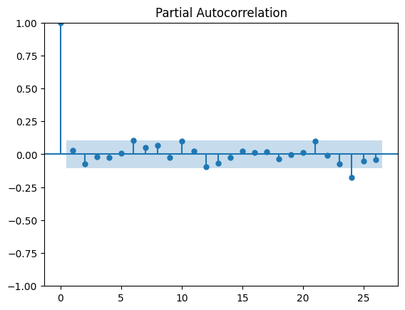 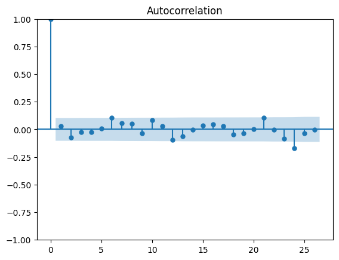 ce qui montre que les autocorrélations semblent rester dans l'intervale de confiance, ce qui suit l'hypothèse du bruit blanc. Il y a un petit valeur d'autocorrélation vers 24 lags, mais cela semble être plutôt porduit du bruit qu'une évidence d'une autocorrélation significative.

### Impulse response
De l'étude de la fonction de réponse sur la figure suivante, on obtient que l'impulse montre une mémoire courte, où le shock décroît vers zéro rapidement, d'où les shocks ne persistent pas dans le temps. 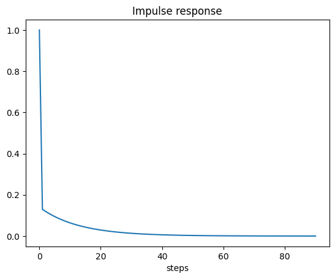

### Q-statistic
Si le test d'hypothèse d'autocorrélation de Q-stat est calculé, les p values obtenues sont ceux du tableau suivant:

|lag | pvalue |
|--------------|--------|
|1             |0.604093|
|2             |0.331133|
|3             |0.492176|
|4             |0.627785|
|5             |0.756833|
|6             |0.328794|
|7             |0.332176|
|8             |0.340709|
|9             |0.395096|
|10            |0.281037|

d'où on obtient que l'hypothèse nulle ne peut pas être écartée, d'où on conclue que les résidus ne sont pas autocorrelés.

Finalement, on visualise les fitted values pour étudier si la tendance a été bien captée par le modèle:
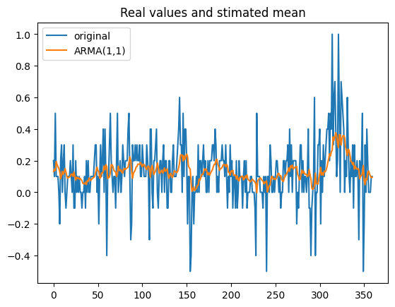
où on voit que la tendance est bien captée par par le modèle. Ensuite, les résidus du modèle (ci-dessous) ressemblent du bruit blanc, ce qui a de sens d'après les études réalisés. 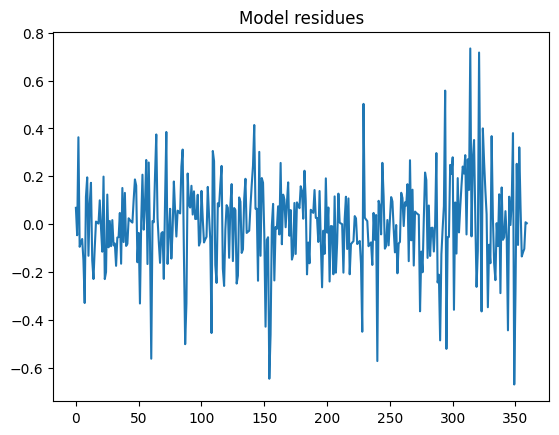

Voyant que les plots précedentes ne sont très différentes, les valeurs, la moyenne stimée et les résidus ont été graphées ci-dessous pour plus de claireté:
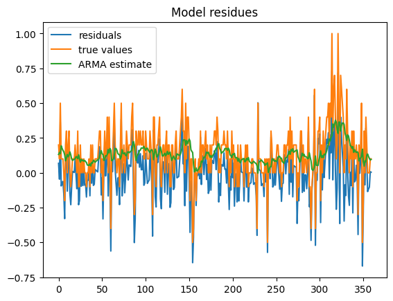

## GARCH
En tant que baseline, on essaie tout d'abord un modèle GARCH sur les données pour évaluer l'impact du modèle ARMA précendente. Au premier moment, les p-values des coefficients du modèle semblent être significatifs:

| coeff | p-value |
|--------------|------------|
|omega         |8.325067e-02|
|alpha[1]      |3.855780e-03|
|beta[1]       |4.168697e-25|

Par contre, ceux du GARCH sur les résidus du modèle ARMA(1,1) ne semblent être pas tous si significatifs:

| coeff | pvalue|
|--------|--------|
|omega   |0.217991|
|alpha[1]|0.102603|     
|beta[1] |0.000001|    

Néanmois, pour la correcte comparaison, les critères AIC et BIC doivent être considerés:

| model | AIC | BIC |
|-------|-----|-----|
|garch-base | -57.88096441526536 | -46.22265232091489 |
| garch-arma | -190.72818867476323 | -179.06987658041277|

ce qui montre que le modèle ARMA prédente est signficatif et les modèles GARCH pour la suite seront stimées sur ses résidus. Si on étude les coeffcients obtenus, sur la table ci-dessous, on peut voir que la somme est bien en dessous de 1, ce qui confirme l'hypothèse de stationnarité.

| coeff | value |
|--------|--------|
|omega   |0.004616|
|alpha[1]|0.116884|
|beta[1] |0.757214|

### Comparaison
Ensuite, GARCH a été stimé avec les distributions t-student et GED. Le tableau de comparaison des p-values ci-dessous montre que les coefficients sont bien plus significatifs pour les distributions non gaussiennes.

| coeff  |gaussian|t-student   |GED         |
|--------|--------|------------|------------|
|omega   |0.217991|7.350181e-02|1.229680e-01|
|alpha[1]|0.102603|6.512143e-02|7.979812e-02|
|beta[1] |0.000001|4.068092e-07|3.843835e-07|
|nu      |NaN     |9.926439e-06|1.824966e-29|

pour le choix de modèle, les critères AIC et BIC sont montrés ci-dessous:

|criterion  |gaussian|t-student   |GED         |
|--------|--------|------------|------------|
|AIC     |-190.728189|-210.508049 |-207.116110 |
|BIC     |-179.069877|-194.963633 |-191.571694 |

alors on conclue que la meilleur distribution est t-student. Bien que les coefficients de omega et alpha ne soient pas significatifs, ils le sont à 10%, ce qui donne évidence à la validité du modèle. Avant de considerer l'utilisation d'IGARCH, les coefficients doivent être vérifiés:

| coeff | value |
|--------|--------|
|omega   |0.006282|
|alpha[1]|0.135997|
|beta[1] |0.699297|
|nu      |5.220113|

où la somme entre alpha et beta n'est pas proche à 1, ce qui nous donne pas de motivation pour l'estimation d'IGARCH.

### Diagnostic du modèle
Pour le diagnostique du modèle, plusieurs graphes sont proposés. Tout d'abord, les résidus standarisées sont visualisés ci-dessous. Ceux-ci ressemblent aux bruit blanc, comme attendu.
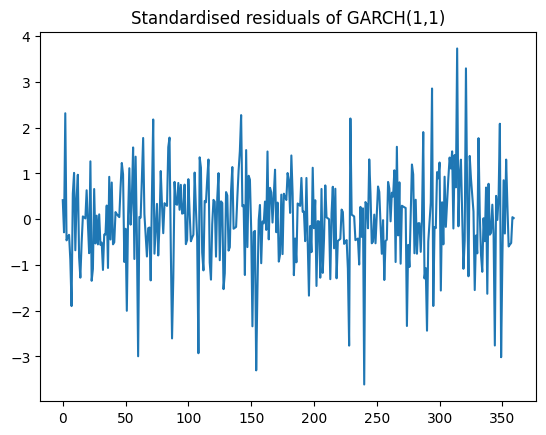
Ensuite, la variantion standard conditionelle est aussi tracée:
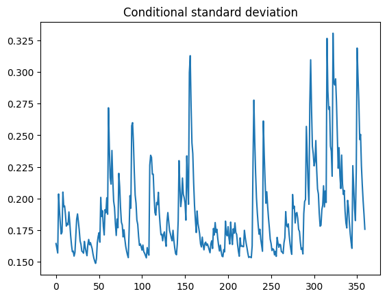
Ceci nous montre le comportement attendu, des clustering de variance avec un retour à la moyenne, ce qui suit les hypothèse du GARCH.

Puis, les autocorrélations des residus standarisés sont tracés, où on peut s'apercevoir qu'il n'y a pas d'autocorélation apparente:
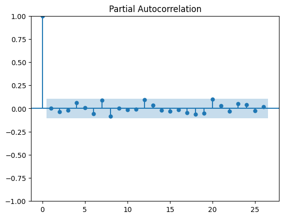
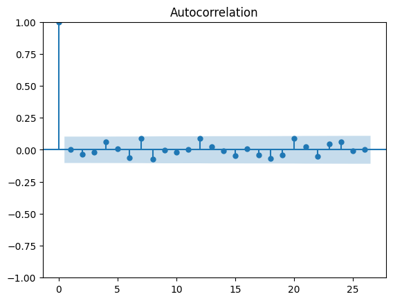
Ceci montre qu'il n'y a pas d'effet GARCH résiduel, évidence d'un modèle bien spécifié. D'après cette évaluation, les résidues standarisées devraient avoir une distribution bien ajoustée à celle d'une t-student, ce qui est montrée sur la figure suivante.
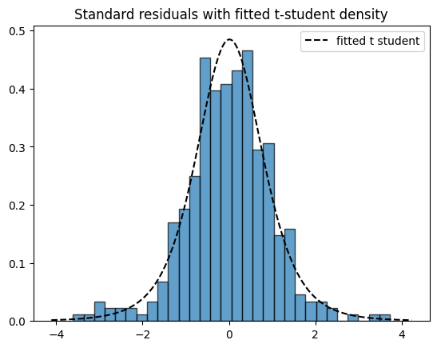
Ainsi, la distribution ajoustée a un $\nu = 5.2$ ce qui montre que la distribution t-student modélise les résidues standarisées mieux que la gaussienne. 

Ensuite, le test GARCH (LM) a été realisé pour les résidus standarisés, mais pas avant de le faire pour les résidus de l'ARMA,au but de vérifier que le phénomene GARCH était bien présente et qu'il a été bien capturé par le modèle GARCH:
| model | p-value |
|-------|---------|
|ARMA | 0.0037 |
|ARMA + GARCH | 0.59 |

Ceci montre une  forte évidence de la présence du phénomene et la bonne capture par le modèle stimé.

## Racines Unitaires
D'après les observations ci-dessus, il n'y a pas d'évidence de non-stationarité de la série jusqu'à ce moment, mais il faut de même le vérifier. Pour cela, on utilise le test de Dickey-Fuller augmenté (ADF), ce qui nous rend un p-value de 0.0001, alors on rejette forcément l'hypothèse nulle: il n'y a pas d'évidence d'une racine unitaire.

Pour une analyse plus complète, on teste plusieurs versions du test, selon le contrôle de tendances:
| regression | p-value |
|------------|---------|
| none | 0.0205 |
| constant | 0.000 |
| constant and trend | 0.000 |
| constant and trend and quadratic trend | 0.003 |

Ce qui montre définitivement qu'il n'y a pas d'évidence de la présence d'une racine unitaire, soit quelle soit la tendance possible. Cela indique qu'il n'y a pas de raison de différentier la série, en vue qu'elle est déjà stationnaire. Ceci aussi valide l'analyse ci-dessus.

## VAR
Pour la suite, on prends la variation mensuelle des aliments: aliments hors produits frais (ASFP) et produits frais (FP). La série précendente n'est pas adaptée pour un analyse multivariée parce que c'est la seule mesure contrôlée par rapport à la saisonalité dans les données et les autres groupes de produits sont y compris.

Les plots des nouvelles variables sont montrés ci-dessous:
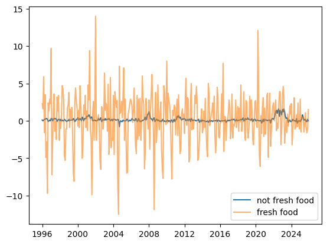
où c'est possible d'observer que ces courbes suivent une certaine tendance partagée, mais les produits frais ont un variation bien plus élévée. Avec 360 observations, c'est à dire 30 ans, cela est facilement explicable par les variations saisonnieres, ainsi que des facteurs qui relient à la production "à temps" de ces produits.

À priori, la saisonnalité ne sera pas traitée: une analyse agnostique. Tout d'abord, il faut vérifier que les composantes soient stationnaires, ce qui est réalisé avec le test ADF:
| variable | p-value |
|----------|---------|
|ASFP|1.867874e-04 | 
|FP|4.492215e-09|

Ceci montre qu'il n'y a pas d'évidence de racines unitaires, pour lequel les composantes seront suposées stationaires pour la suite. Néanmois, les PACF et ACF sont quand même étudiées. Les PACF de ASPF et PF sont montrées ci-dessous (dans cet ordre):
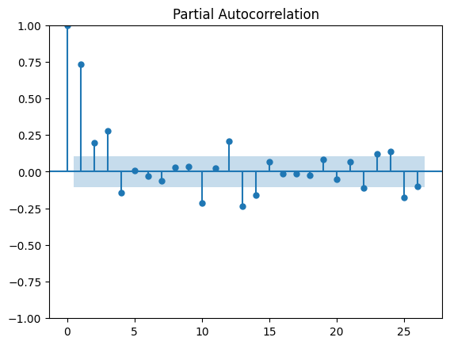
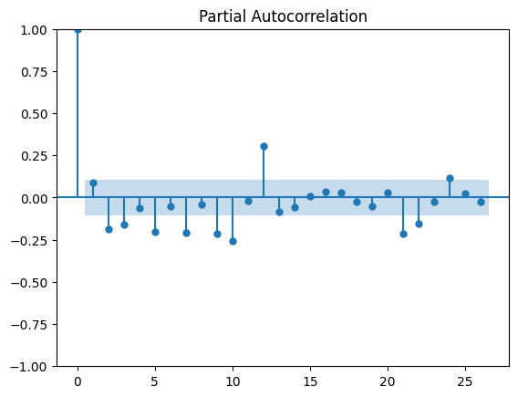
et celles de ACF:
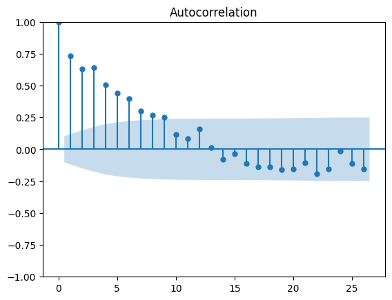
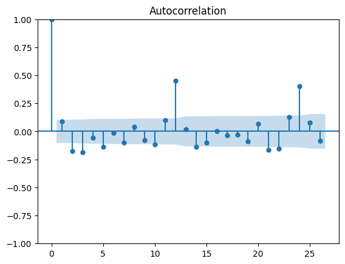
d'où les suspections de saisonnalitée resourfacent, grâces aux corrélations de 12 et 24 (notamment sur l'ACF de FP). Malgré cela, l'analyse ne prendra en compte cette saisonnalité (en tant que contenu hors de le scope du projet).

Ensuite, les ordres de VAR doivent être seléctionnés, pour lequel le tableu suivant a été construit:

|lags|AIC    |BIC     |FPE    |HQIC   |
|------|-------|--------|-------|-------|
|0     |0.01963|0.04235 |1.020  |0.02869|
|1     |-0.8031|-0.7350 |0.4479 |-0.7760|
|2     |-0.8961|-0.7825 |0.4081 |-0.8508|
|3     |-0.9866|-0.8276*|0.3728 |-0.9232|
|4     |-1.003 |-0.7981 |0.3669 |-0.9211|
|5     |-1.009 |-0.7593 |0.3645 |-0.9096|
|6     |-1.009 |-0.7139 |0.3645 |-0.8915|
|7     |-1.057 |-0.7160 |0.3476 |-0.9210|
|8     |-1.049 |-0.6625 |0.3504 |-0.8948|
|9     |-1.114 |-0.6825 |0.3283 |-0.9421|
|10    |-1.243 |-0.7659 |0.2886 |-1.053 |
|11    |-1.233 |-0.7101 |0.2916 |-1.024 |
|12    |-1.370 |-0.8021 |0.2542 |-1.144*|
|13    |-1.378 |-0.7645 |0.2523 |-1.133 |
|14    |-1.388 |-0.7296 |0.2497 |-1.126 |
|15    |-1.373 |-0.6688 |0.2536 |-1.092 |
|16    |-1.371 |-0.6211 |0.2542 |-1.072 |
|17    |-1.358 |-0.5624 |0.2577 |-1.041 |
|18    |-1.348 |-0.5076 |0.2601 |-1.013 |
|19    |-1.347 |-0.4605 |0.2607 |-0.9934|
|20    |-1.329 |-0.3974 |0.2654 |-0.9576|
|21    |-1.359 |-0.3823 |0.2576 |-0.9698|
|22    |-1.397 |-0.3748 |0.2481 |-0.9897|
|23    |-1.389 |-0.3207 |0.2504 |-0.9629|
|24    |-1.399*|-0.2857 |0.2479*|-0.9552|

d'où la quantité de lags à utiliser a été choisie comme 12, voyant la tendance plutôt plate de l'AIC, FPE et l'optimalité par rapport à HQIC. La différence de BIC n'est pas significative.

Ensuite, le VAR a été ajousté et les p-values obtenus.Ces valeurs sont detaillées sur le tableu suivant: 
|FIELD1  |FP          |ASFP        |
|--------|------------|------------|
|const   |9.817262e-01|9.595375e-01|
|L1.FP   |4.324361e-05|3.578963e-02|
|L1.ASFP |4.313964e-01|1.262010e-08|
|L2.FP   |7.845107e-09|3.572106e-01|
|L2.ASFP |9.769884e-01|5.238548e-02|
|L3.FP   |7.752250e-10|5.141585e-01|
|L3.ASFP |1.622765e-01|6.872779e-01|
|L4.FP   |5.687943e-12|3.940452e-02|
|L4.ASFP |1.698324e-01|1.350943e-02|
|L5.FP   |2.451409e-10|1.950322e-02|
|L5.ASFP |1.563796e-01|6.509347e-01|
|L6.FP   |7.178461e-06|5.280860e-01|
|L6.ASFP |5.758835e-01|8.047216e-01|
|L7.FP   |7.065265e-05|2.079919e-03|
|L7.ASFP |5.316309e-01|2.884829e-02|
|L8.FP   |9.834851e-04|5.961535e-01|
|L8.ASFP |9.798318e-01|5.960105e-01|
|L9.FP   |3.150002e-01|1.267059e-01|
|L9.ASFP |1.581907e-01|5.588873e-01|
|L10.FP  |6.882874e-01|9.693582e-01|
|L10.ASFP|1.680526e-01|2.298063e-01|
|L11.FP  |5.771115e-01|5.413738e-01|
|L11.ASFP|7.567492e-01|1.250017e-01|
|L12.FP  |4.545992e-11|9.590485e-01|
|L12.ASFP|2.917952e-01|7.624610e-17|

Pour mieux apprecier les significances, un heatmap (0 si non, 1 si oui) des significance a été construit:
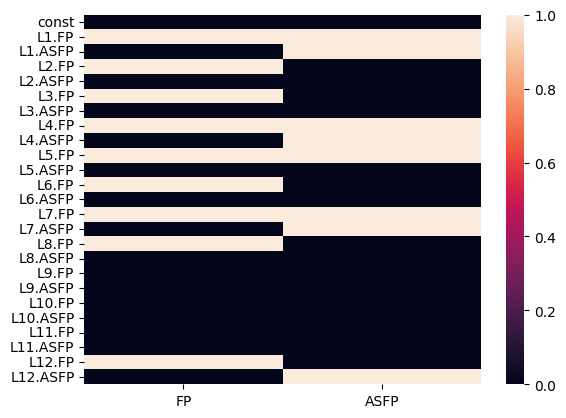
d'où la tendance des produits alimentaires hors produits frais semblent influencer à aux produits frais, mais pas autant à l'inverse. Pour étudier cette relation, un test de causalité sera fait dessous, mais avant les modules des inverses des raciones doivent être considerées:
|root | module |
|------|--------|
|0     |1.196186|
|1     |1.196186|
|2     |1.147271|
|3     |1.147271|
|4     |1.112399|
|5     |1.112399|
|6     |1.086946|
|7     |1.086946|
|8     |1.074866|
|9     |1.074866|
|10    |1.070731|
|11    |1.070731|
|12    |1.068290|
|13    |1.068290|
|14    |1.064753|
|15    |1.064753|
|16    |1.063729|
|17    |1.063729|
|18    |1.056891|
|19    |1.056891|
|20    |1.040010|
|21    |1.040010|
|22    |1.036002|
|23    |1.036002|

d'où on conclue que le procesus ARIMA est stationnaire, ainsi qu'estable. Finalement, le determinant de Omega MLE est 0.0207. 

Finalement, le tableu des p-values du test de causalité est le suivant (les valeurs $C_{ij}$ signifient que $i$ cause $j$):
| | ASFP | FP |
|----|----|----|
| ASFP | 0.00 | 0.29 |
| FP | 0.02 | 0.00 |

ce qui évidence le comportement supossé ci-dessous: les produits non frais causent un effet sur les frais, mias l'inverse n'est pas le cas.

Ensuite, les réponses aux shocks ont été étudiées:
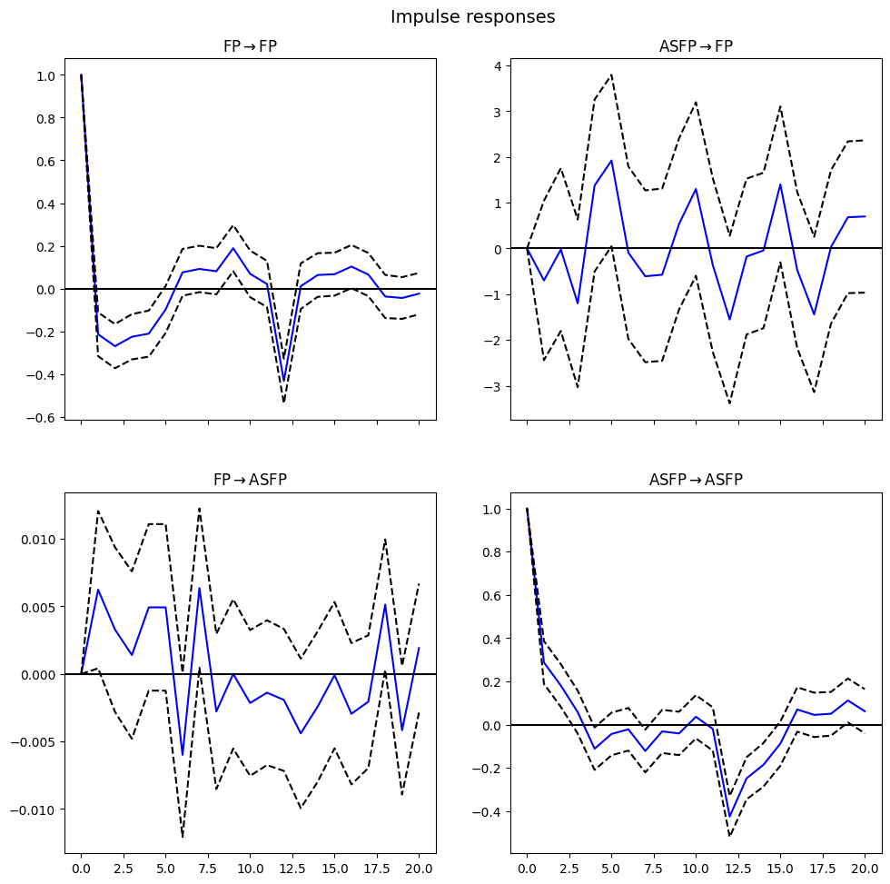
Les shocks des variables sur elle mêmes semblent s'éteigner après une réversion temporelle avant de s'approcher à zéro. Ceci n'est pas un phénomène trop étonnant, même s'ils montrent une certaine volatilité. Néanmois les effets de ASFP montre une rélation faible ou inestable, même pas robust statistiquement, pourrait indiquer que la rélation est plutôt produit du bruit qu'une relation réelle. Ce comportement est ainsi observé pour la rélation inverse, ce qui pourrait montrer une rélation très faible entre les variables.

